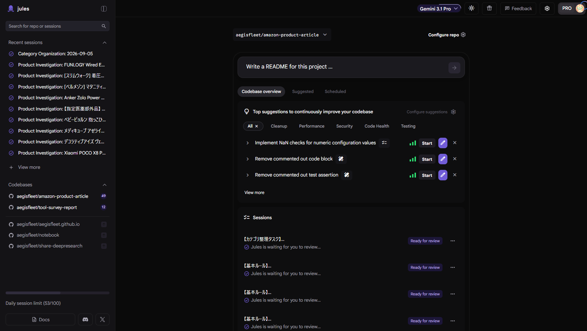

## 仕事

- 開発
  - IDE
    - VS Code - GitHub Copilot (Gemini 4.8 Flash) 
  - 自律型AIエージェント
    - GitHub Copilot Coding Agent (Claude Sonnet 5) 
- 情報収集
  - 技術調査
    - Google NotebookLM 

## プライベート

- 開発
  - IDE
    - Antigravity (Gemini 4.8 Flash) 
  - 自律型AIエージェント
    - Google Jules (Gemini 3.1 Pro) 

      

    - Gemini Spark 

      

    - OpenAI Codex 
  - コード保全
    - CodeRabbit 
    - SonarQube 
- 情報収集
  - 技術調査
    - Gemini DeepResearch 
    - Google NotebookLM 
  - SNS検索
    - SpaceXAI Grok 
- 画像生成
  - Gemini Nano Banana 
  - ChatGPT Images 
- 動画生成
  - Google Omni 
- 音楽生成
  - Google Lyria 
