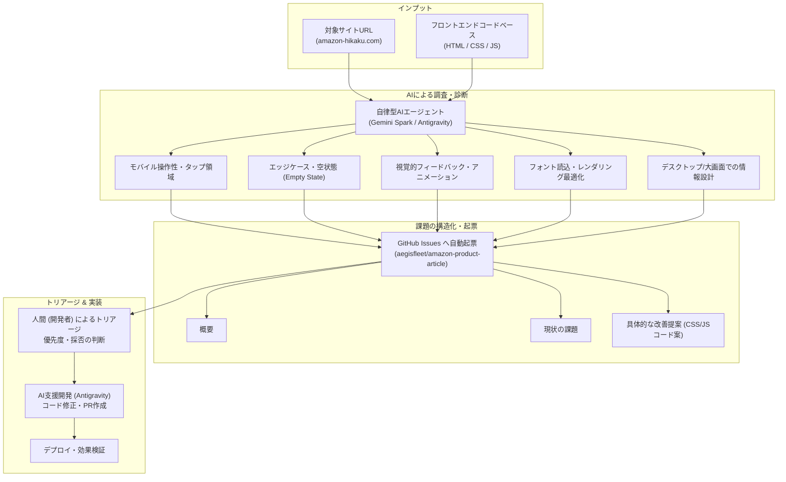

## 概要

個人開発や小規模チームにおけるWebサイト運用では、UI/UXの客観的なレビューやエッジケースの検証に十分なリソースを割きにくいという課題がある。作者自身の目線では気づきにくい操作上の不便さや、特定デバイス幅でのレイアウト崩れ、フィードバック不足といった細かな問題は放置されやすい。

本ドキュメントでは、実際に運用しているWebサイト [amazon-hikaku.com](https://www.amazon-hikaku.com/) に対し、自律型AI（Gemini Spark や Antigravity）を活用してUI/UXの改善点を調査させ、GitHubリポジトリ（[aegisfleet/amazon-product-article](https://github.com/aegisfleet/amazon-product-article)）のIssuesへ自動起票させた事例を紹介する。

どのような改善提案がなされ、それをどのように実際の改善サイクルへ落とし込んだのか、AI駆動のUI/UX改善運用イメージをまとめる。

---

## 改善ワークフロー（全体像）

AIを活用したUI/UX改善は、単に「改善点を教えて」と尋ねるだけでなく、調査からIssue起票、実装までを一連のパイプラインとして回す点に特徴がある。

1. **インプット提供**: 公開サイトのURLに加え、フロントエンドのソースコードをAIに参照させる。
2. **多角的診断**: 画面幅別のレスポンシブ崩れ、インタラクション時のフィードバック、フォント読み込み挙動など、複数の専門的観点からサイトを走査させる。
3. **Issue自動起票**: 発見された問題点を「概要」「現状の課題」「改善提案（実装コード例含む）」のフォーマットに構造化し、GitHub Issueとして起票する。
4. **トリアージと実装**: 人間が優先度を判定した後、Antigravity等の開発環境でIssueの提案コードをベースに迅速に修正・リリースする。

---

## 実際に起票された改善提案の分析

実際にGemini SparkやAntigravityを通じて [GitHub Issues](https://github.com/aegisfleet/amazon-product-article/issues) に起票された改善提案は、大きく以下の4つのカテゴリに分類される。

### 1. モバイルファーストの操作性・レイアウト改善

スマートフォン閲覧時のファーストビュー圧迫や、指でのタップ操作（44px以上のタッチターゲット確保）、特定端末幅でのテキスト衝突など、実機操作でストレスとなりやすい点が抽出された。

| Issue | タイトル | 課題と改善提案の内容 |
| :--- | :--- | :--- |
| [#10840](https://github.com/aegisfleet/amazon-product-article/issues/10840) | 商品詳細ページ上部ナビボタン群のファーストビュー圧迫緩和 | 画面上部に複数並ぶ誘導ボタンが画面上部を占有し、主要情報（価格・評価・結論）が下へ押し出されていた。ボタン群をコンパクトな横スクロールピルUIに小型化、または本文下部に移設してファーストビューを確保する提案。 |
| [#10838](https://github.com/aegisfleet/amazon-product-article/issues/10838) | モバイル表示における並び替えボタン群の均等グリッド化 | 6種類の並び替えボタンが画面幅に応じて不揃いに折り返されていた。CSS Gridによる2列均等配置（`repeat(2, 1fr)`）やセレクトボックス化により、タップ領域と視線誘導を均一化する提案。 |
| [#10837](https://github.com/aegisfleet/amazon-product-article/issues/10837) | モバイル環境でのキーワード検索プレースホルダーの見切れ改善 | 検索窓の案内テキストが長すぎてモバイル幅で途中で見切れていた。メディアクエリやJSを用いて、画面幅に応じて簡潔な文言へ自動短縮するレスポンシブ対応を提案。 |
| [#10836](https://github.com/aegisfleet/amazon-product-article/issues/10836) | 二連価格スライダーの目盛りテキスト重なりの解消 | 画面幅375px付近で左右のスライダーが横並びになり、目盛りラベル（¥0, ¥2k, ¥50k等）が重なって判読不能になっていた。モバイル時の縦並び（`flex-direction: column`）化や目盛りの間引きを提案。 |
| [#10835](https://github.com/aegisfleet/amazon-product-article/issues/10835) | フローティング要素による本文被りと操作領域圧迫の改善 | 画面上に「目次」「トップへ」「メニュー」の3つの浮遊ボタン（FAB）が常駐し、本文や表に重なっていた。スクロール時の非表示/ピル化や、本文最下部の余白（`padding-bottom`）確保を提案。 |

### 2. インタラクション・フィードバック・状態設計（Edge Cases）

正常系では見落とされがちな「検索結果が0件になったときの状態（Empty State）」や、操作完了時の明示的フィードバックの不足が的確に指摘された。

| Issue | タイトル | 課題と改善提案の内容 |
| :--- | :--- | :--- |
| [#10842](https://github.com/aegisfleet/amazon-product-article/issues/10842) | フィルター絞り込み結果が0件になった際の「条件リセット」追加 | 絞り込み条件に一致する商品が0件の際、「該当商品がありません」の文字のみでユーザーが立ち往生していた。0件表示エリア内に「条件をリセットする」「キーワードのみクリア」ボタンを直接配置し、離脱を防止する提案。 |
| [#10841](https://github.com/aegisfleet/amazon-product-article/issues/10841) | お気に入り登録・解除時のフィードバック（トースト通知）追加 | ハートアイコン押下時にアイコン色が反転するだけで登録完了が伝わりにくかった。画面下部にスナックバー（「お気に入りに追加しました [リストを見る]」）を数秒表示し、回遊性を向上させる提案。 |
| [#10834](https://github.com/aegisfleet/amazon-product-article/issues/10834) | フィルターパネルの初期選択時に✕ボタンが常時表示される不具合 | 「すべてのカテゴリ」選択状態（初期状態）でも条件クリア用の「✕」ボタンが表示され、無効な操作感を与えていた。空文字以外の選択時のみ表示する表示制御ロジックの追加を提案。 |

### 3. デスクトップ環境での情報アクセス性

モバイル対応を重視するあまり、PCなどの大画面環境で画面余白が活用されていなかった問題に対する指摘である。

| Issue | タイトル | 課題と改善提案の内容 |
| :--- | :--- | :--- |
| [#10839](https://github.com/aegisfleet/amazon-product-article/issues/10839) | デスクトップ表示時のグローバルナビゲーション（ヘッダーメニュー）拡充 | PC大画面でもヘッダー右のハンバーガーメニュー内に全リンクが隠されており、クリック数が増加していた。768px以上の画面ではヘッダーに主要リンクを水平展開し、アクティブインジケーターを付与する提案。 |

### 4. レンダリング・パフォーマンス最適化

CSSやフォントの読み込み挙動に関する技術的ディテールにも踏み込んだ提案が行われた。

| Issue | タイトル | 課題と改善提案の内容 |
| :--- | :--- | :--- |
| [#10833](https://github.com/aegisfleet/amazon-product-article/issues/10833) | Material Symbols（アイコンフォント）のFOUT防止と合字最適化 | 低速回線時にアイコン名が生テキスト（`search`, `payments`等）として露出するFOUT（Flash of Unstyled Text）が発生していた。事前読み込み（preload）や `font-feature-settings: 'liga';` のCSS明示によるちらつき防止を提案。 |

---

## AI調査・起票の強みと運用の勘所

この運用モデルを通じて実感された、AIによるUI/UX改善の強みとポイントは以下の通りである。

### 1. 「エッジケース」に対する高い検出力
開発者は無意識に「うまく動くパターン（ハッピーパス）」でサイトを確認しがちである。一方、AIは以下のような見落としやすい境界条件を網羅的に検証する。
- **画面幅375px・414px等の実機特有のサイズ**: スライダーの目盛り重複（#10836）やプレースホルダーの見切れ（#10837）。
- **0件時の挙動（Empty State）**: 絞り込みすぎて該当データがない際の復帰導線の欠落（#10842）。
- **ネットワーク遅延や描画順序**: WebFont読み込み途中のアイコンテキスト露出（#10833）。

### 2. 「課題提起」から「実装方針」までの一気通貫
AIによるIssue起票では、不満点の列挙にとどまらず、具体的なCSSプロパティ（`grid-template-columns`, `display: inline-flex`）やJavaScriptのイベント制御方針がセットで提示される。そのため、Issueを読んだ開発者が即座に実装の当たりを付けることができる。

### 3. 発見（Gemini Spark）と実装（Antigravity）のシナジー
- **Gemini Spark（自律型エージェント）**: サイト全体を巡回し、人間が見落とした課題を洗い出してGitHub Issuesとして構造化・ストックする。
- **Antigravity（次世代IDE）**: 起票されたIssueをもとに、IDE上でAIペアプログラミングを行い、修正コードの適用・テスト・PR作成を短時間で完遂する。

この役割分担により、「課題を発見してもチケット化が面倒で放置される」「Issueはあるがコード化が進まない」という個人開発特有のボトルネックを解消できる。

---

## まとめ

WebサイトのUI/UX改善において、AIは単なる質問応答ツールではなく、**「24時間いつでも客観的にサイトを点検してくれる専属のUI/UXリサーチャー兼QAエンジニア」** として機能する。

URLとコードベースを渡し、課題をGitHub Issuesへ自動起票させる仕組みを整えることで、開発者は「意思決定と最終確認」に集中しながら、サイトのクオリティを迅速に底上げすることが可能になる。
