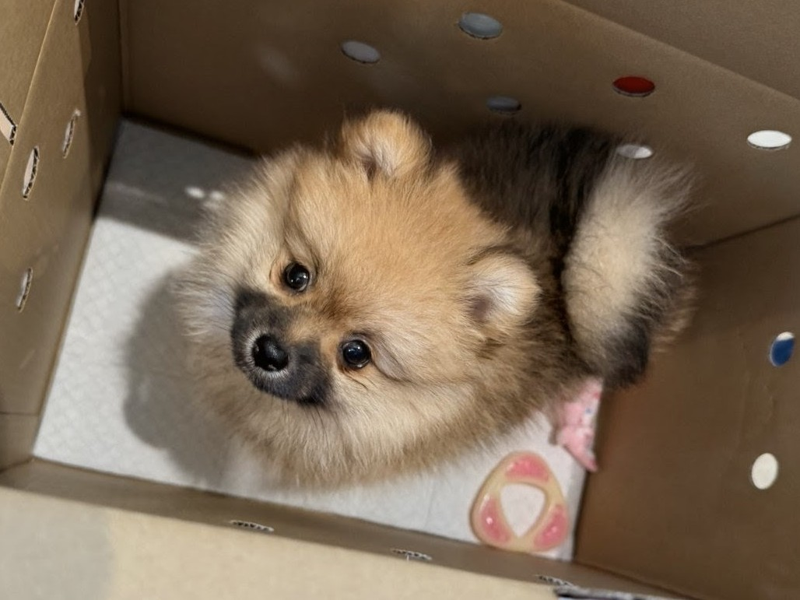
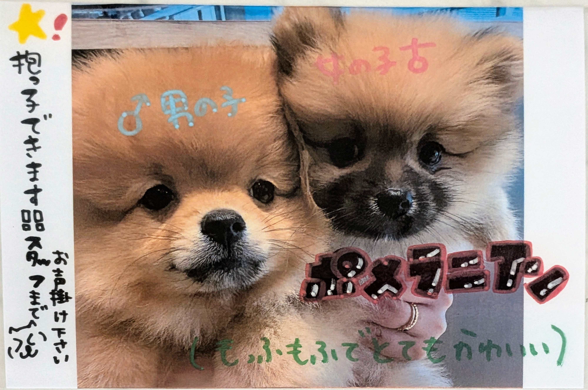
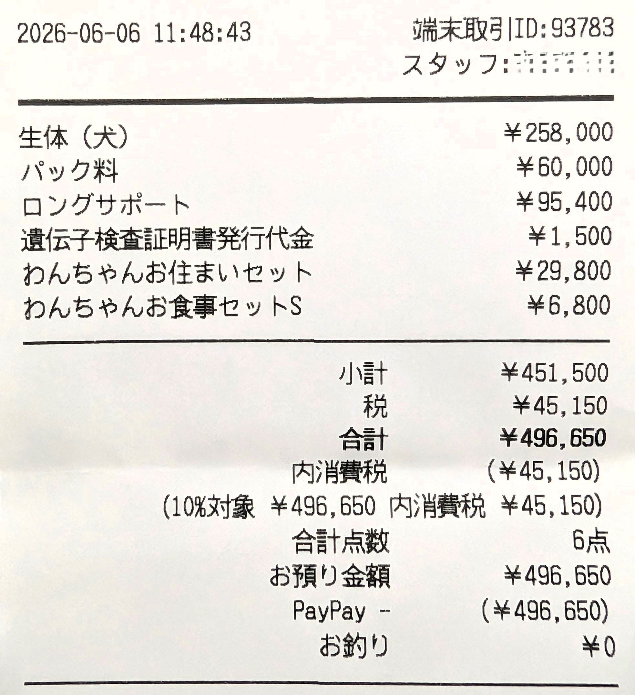
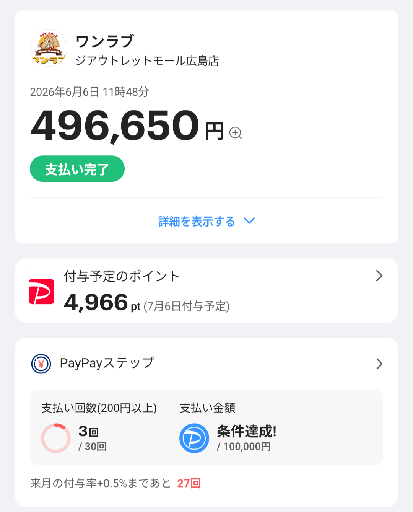
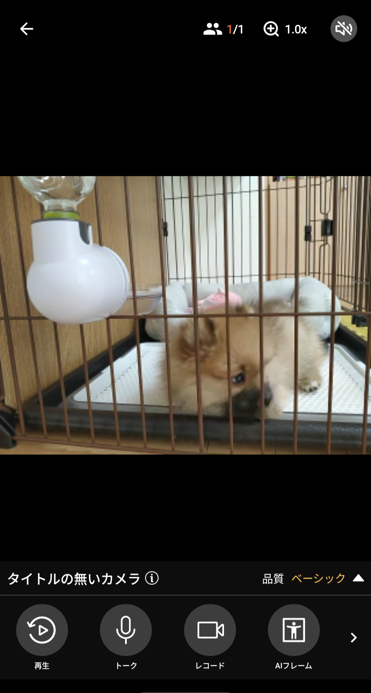
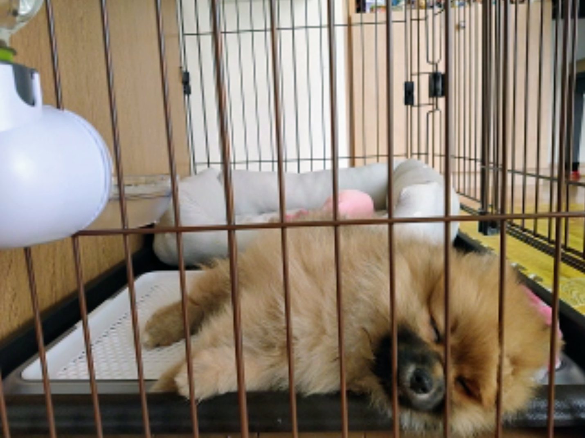

## 基本情報

| 項目 | 内容 |
| --- | --- |
| 名前 | パム |
| 犬種 | ポメラニアン |
| 性別 | メス |
| 誕生日 | 2026年3月23日 |
 

## 初期費用

- 約50万円

### 関連費用

- LoveLoveパック という名の何故のセット商品
  - 60,000円
    - 事故補償（3年間）: 万が一の事故に対する生命補償です。
    - マイクロチップ装着: 義務化されている識別チップの装着費用です。
    - 初回ワクチン代: 店舗での1回目の接種費用です（2回目以降は自己負担）。
    - メディカルチェック: お渡し前の獣医師による健康診断です。
    - 外部寄生虫駆除: ノミ・ダニなどの駆除薬の投与です。
    - 遺伝子検査: 純血種のみが対象となる遺伝子疾患のスクリーニング検査です。
    - 獣医師24時間サポート（1年間）: 深夜の体調不良などを相談できる窓口です。
    - 各種サポート（各1年間）: トレーナーによるしつけサポートや、WEB健康診断が含まれます。
    - タイムカプセル: お迎え時の記念特典です。
- [ロングサポート](https://www.pet-onelove.com/indemnity/) という名の生命保険
  - 3年間: 95,400円
    - 巨大食道症
    - 心筋症
    - 僧帽弁閉鎖不全症
    - 動脈管開存症
    - 心房中隔欠損症
    - 心室中隔欠損症
    - 肺動脈狭窄症
    - ファロー四徴症
    - 肝性脳症
    - てんかん
    - 水頭症
    - 小脳障害
    - 甲状腺機能低下症
    - 副腎皮質機能低下症
    - アジソン病
    - 骨の悪性腫瘍
    - 腸・肝臓・肺の悪性腫瘍

## ランニングコスト

### 任意保険

- [うちの子](https://www.ipet-ins.com/products/uchinoko/fee/) ※ペットショップ提携保険
  - 70%補償プラン: 3,090円/月
- [これだけペット](https://www.paypay-insurance.co.jp/promotion/pet/app/)
  - 安心プラン: 1,850円/月
- [ペットほけんフィット](https://www.fpc-pet.co.jp/lp10)
  - 70%補償プラン: 1,580円/月

## 環境

- 監視カメラ
  - [アルフレッドカメラ](https://alfred.camera/ja)
    - [古いスマホの再活用ができる](https://alfred.camera/ja/how-it-works)

### 日用品

- [ドッグフード](https://www.amazon-hikaku.com/categories/%E3%83%89%E3%83%A9%E3%82%A4%E3%83%89%E3%83%83%E3%82%B0%E3%83%95%E3%83%BC%E3%83%89/)
- [ペットシーツ](https://www.amazon-hikaku.com/categories/%E7%8A%AC%E7%94%A8%E3%83%88%E3%82%A4%E3%83%AC%E3%82%B7%E3%83%BC%E3%83%88/)
- [除菌・消臭](https://www.amazon-hikaku.com/categories/%E9%99%A4%E8%8F%8C%E5%89%A4/)
  - 店員さんおすすめ: [ビューティーエコ パルジェット](https://www.amazon-hikaku.com/b0056laqv6/)
- [スリッカーブラシ](https://www.amazon-hikaku.com/categories/%E7%8A%AC%E7%94%A8%E3%83%96%E3%83%A9%E3%82%B7/)
