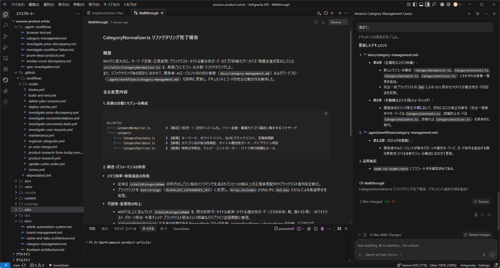
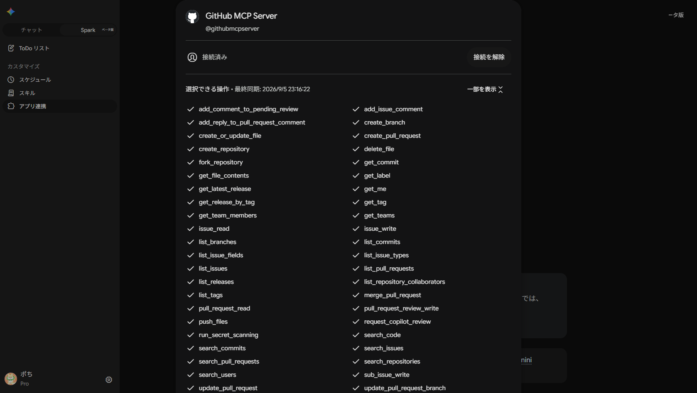

## 統合開発環境 (IDE)

- [Antigravity](https://antigravity.google)

  

## 自律型AIエージェント

- [Google Jules](https://jules.google)

  

- [Gemini Spark](https://gemini.google.com)

  

## コードの品質担保

- [Biome](https://biomejs.dev/)
- [CodeQL](https://codeql.github.com/)
- [SonarQube](https://sonarcloud.io/)

## コードレビュー

- [CodeRabbit](https://coderabbit.ai/)

## パッケージ管理

- [pnpm](https://pnpm.io/)
- [uv](https://docs.astral.sh/uv)
- [Takumi Guard](https://flatt.tech/takumi/features/guard)
- [Dependabot](https://github.com/dependabot)

## GitHub Actions

- [pinact](https://aegisfleet.github.io/tool-survey-report/reports/pinact/)
- [zizmor](https://zizmor.sh/)
