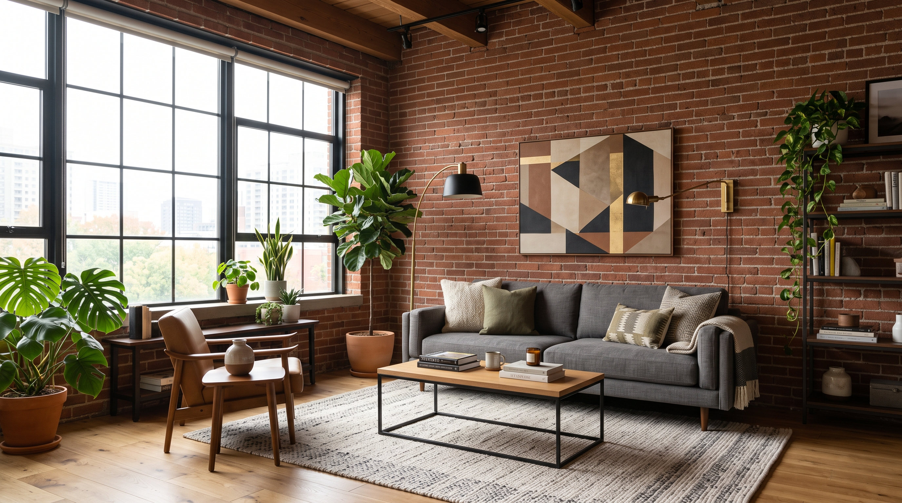

ビデオ会議（Zoom、Microsoft Teams、Google Meet など）で利用できるバーチャル背景画像集。

画像を右クリック（または長押し）して保存するか、画像ファイルリンクからオリジナル解像度を開いてダウンロード可能。

## 背景画像一覧

### 1. レンガ壁と観葉植物のロフトリビング
大きな格子窓から自然光が差し込む、インダストリアル調のロフトリビング空間。赤レンガの壁にグレーのファブリックソファ、モンステラやフィカスなどの豊かな観葉植物が配置され、明るく温かみのある雰囲気を演出できる。

- **おすすめシーン**: 日中のミーティング、カジュアルな打ち合わせ、1on1
- **特徴**: 自然光、インダストリアル・レンガ調、グリーン（観葉植物）

- **画像ファイル**: [Loft_living_room_interior_design_202608182053.jpeg](Loft_living_room_interior_design_202608182053.jpeg)

---

### 2. 重厚な書斎とレザーウィングバックチェア
天井近くまで本が並ぶクラシカルな図書館・書斎空間。中央にはボタン留めの重厚なブラウンレザー製ウィングバックチェアとオットマンが配置され、知性的で落ち着いた品格を演出できる。

- **おすすめシーン**: フォーマルな商談、勉強会、ウェビナー、面接
- **特徴**: クラシック本棚、アンティーク調、ブラウン本革チェア

- **画像ファイル**: [Leather_wingback_chair_in_library_202608182106.jpeg](Leather_wingback_chair_in_library_202608182106.jpeg)

---

### 3. 夜景を望むペントハウス・エグゼクティブオフィス
高層階ペントハウスの大きなガラス越しに、煌めく摩天楼の夜景が広がるラグジュアリーな空間。中央にスタイリッシュなブラックのハイバック・エグゼクティブチェアが配置され、洗練されたエグゼクティブな雰囲気を演出できる。

- **おすすめシーン**: 夕方〜夜の会議、重要なプレゼンテーション、フォーマルな打ち合わせ
- **特徴**: 大都市の夜景、ラグジュアリー、洗練されたモダンオフィスチェア

- **画像ファイル**: [Executive_chair_in_penthouse_2K_202608182107.jpeg](Executive_chair_in_penthouse_2K_202608182107.jpeg)

---

### 4. 開放的なロフトスペースとモダンラウンジチェア
赤レンガとコンクリートフロアが特徴的な広々としたロフトオフィス。中央には包み込むような形状のグレーレザー製ハイバックチェアが置かれ、奥には木製デスクやブックシェルフが見える、開放的でクリエイティブなワーク空間。

- **おすすめシーン**: 定例ミーティング、クリエイティブなブレスト、チームディスカッション
- **特徴**: 開放的なロフト、インダストリアルモダン、グレーハイバックチェア

- **画像ファイル**: [Armchair_in_loft_space_2K_202608182107.jpeg](Armchair_in_loft_space_2K_202608182107.jpeg)

---

## 設定方法

1. 各画像の下にあるファイル名リンクをクリック、または画像を右クリックして「名前を付けて画像を保存」を選択。
2. ご利用のビデオ会議ツール（Zoom / Microsoft Teams / Google Meet 等）の設定画面から背景画像として追加して適用する。
